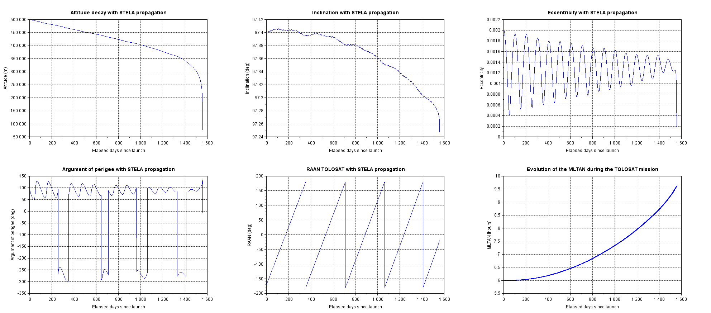
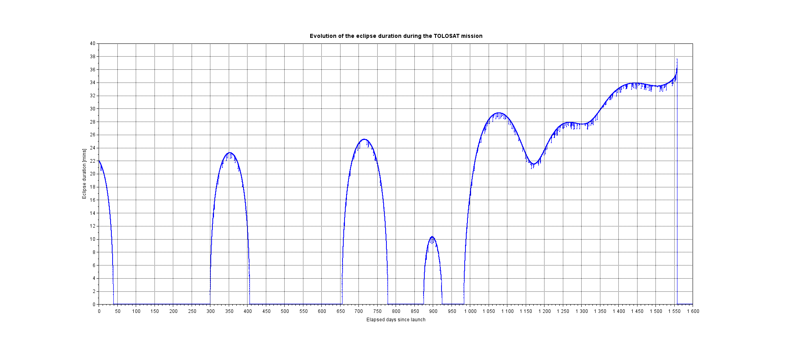
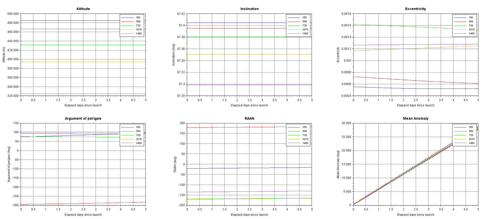

# Export Trajectory
This folder contains two scripts.
- One using the STELA propagator with an integration step of approximately 90 minutes (orbital period at deployment) which exports the mean keplerian parameters, the date as well as the eclipse duration (umbra) in CSV files.
- One using the LYDANE propagator to propagate the trajectory at selected days since deployment for durations of 5 days using the STELA mean keplerian elements as initial conditions. It then exports the satellite and sun ECI coordinates (in meters) along with a time counter (in seconds) in CSV files.

