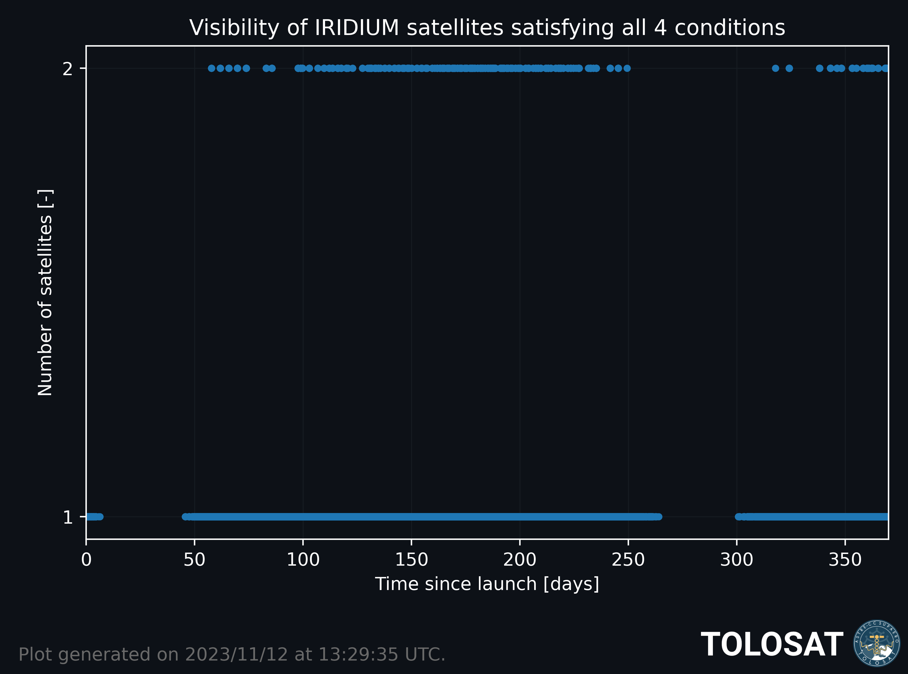
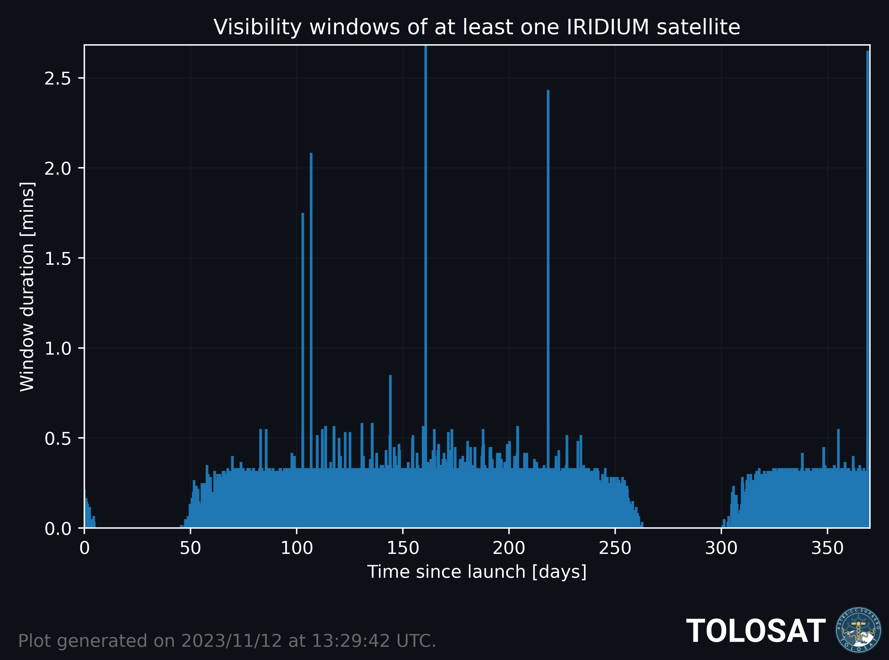

# Iridium study

### [Arnaud Muller](https://www.github.com/Nosudrum) 2022/2023

## Generate Iridium states files

- [`iridium_TLE_sync`](iridium_TLE_sync.py) Get the latest TLEs of the Iridium NEXT constellation from CelesTrak and sync them to the same epoch with SGP4.
- [`iridium_propagation.py`](iridium_propagation.py) Perform the propagation of the entire constellation alongside
  TOLOSAT chunk by chunk and export the states to pickle
  files.

## Analyze Iridium states to find visibility windows

- [`iridium_doppler`](iridium_doppler.py) For each propagation chunk and for each satellite, compute the Doppler shift
  and rate and check when they are below the threshold while geometrical visibilty conditions are satisfied.
- [`iridium_analysis`](iridium_analysis.py) Use the results of the previous script to create plots.

## Visualize results

- [`iridium_visualization`](iridium_visualization.py) A propagation of TOLOSAT and the Iridium constellation with an automatic generation of the VTS file.

## Final results

## Doppler shift & rate of example satellite

